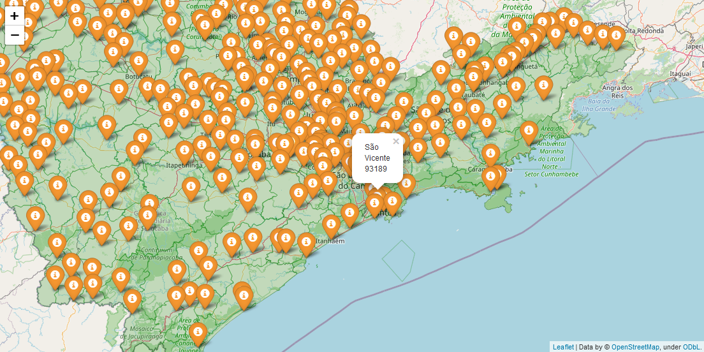

        
<h1> Tema escolhido </h1>

> A aplicação flask desenvolvida tem por objetivo mostrar o paronamora do estado de São Paulo em relação a cobertura do auxílio emergencial destinado aos trabalhadores informais, microempreendedores individuais (MEI), autônomos e desempregados devido à crise causada pela pandemia.

> Para isso utilizou-se as APIs do portal de transparencia do Governo e do IBGE, para coleta de dados do período de abril a agosto de 2020.

- Exemplo: Máximo de Beneficiados pelo Auxílio Emergencial de abril-agosto (2020).

# Principais tecnologias
- Framework flask 1.1.2
- Bootstrap 4.5.3
- Folium 0.11.0
- Python 3.6
- MongoDB

# Regras do projeto

1) <strong>Implementar uma aplicação Python que contenha pelo menos 5 interfaces gráficas (UI).</strong>
    -  O tipo de UI pode ser definido pelos integrantes: Console, Formulário ou Web.
2) <strong>Armazenar dados de maneira persistente utilizando o SGBD da sua preferência.</strong>
    - Os dados precisam ser armazenados em pelo menos um tabelas.
    - Para cada tabela codificar na UI no mínimo três operações, dentre elas:
        - Insert, Update, Delete e Select
3) <strong>Elaborar as seguintes UI (plus):</strong>
    -  <u>Login:</u> em que o usuário deverá fornecer um nome de usuário e uma senha. O acesso as funcionalidades do sistema ocorrem apenas para usuários previamente
cadastrados.
    - <u>Sobre:</u> que apresente dados do projeto {tema escolhido e objetivo} e dos
desenvolvedores.
    - <u>Menu:</u> em que o usuário poderá escolher a opção desejada da aplicação.
4) <strong>Implementar uma funcionalidade que exporta todos os dados da aplicação no formato
JSON.</strong>
    - O arquivo deve ser compactado no formato zip. (plus)
5) <strong>Implementar uma funcionalidade para importa dados. (plus)</strong>
    - Os dados devem ser disponibilizados em um endereço da web.
    - Usar o módulo Requests ou URLlib.
    - Armazenar os dados importados em uma tabela.
    - Apresentar os dados importados em uma UI da aplicação.

